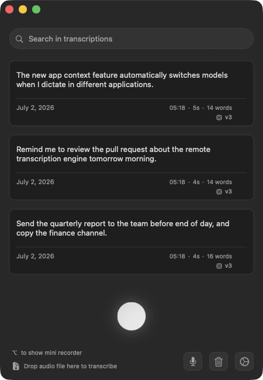

<div align="center">

# Osier

**Notch-native dictation for macOS. Tap Fn+Control, speak, tap again — your words land where you're typing.**

[](LICENSE)



</div>

## Credits — this is a hard fork

Osier is a personal hard fork of
[`my-monkeys/OpenSuperWhisper`](https://github.com/my-monkeys/OpenSuperWhisper) (MIT), which is itself
a maintained fork of [`Starmel/OpenSuperWhisper`](https://github.com/Starmel/OpenSuperWhisper) (MIT).
Essentially all of the engine, audio, insertion and indicator code is theirs; Osier reshapes the
trigger and the notch UI on top of it.

```
Starmel/OpenSuperWhisper  →  my-monkeys/OpenSuperWhisper  →  Osier
```

The MIT licence and its `Copyright (c) 2024 OpenSuperWhisper` notice are preserved verbatim in
[LICENSE](LICENSE) — byte-identical to upstream's. Please direct bug reports about *upstream*
behaviour to my-monkeys, not here; bugs in Osier itself go to
[this repo's issues](https://github.com/ssskay/osier/issues).

## Install

Download the latest **notarized** `.dmg` from
[Releases](https://github.com/ssskay/osier/releases), open it, and drag Osier to Applications.
Or [build from source](#building-from-source).

**Requires** macOS 14 (Sonoma) or later. Apple Silicon gets all three on-device engines;
Intel builds drop SenseVoice (its runtime is arm64-only).

## The basics

- ⌨️ **Global shortcut** — a key combination or a single modifier key (Fn, Right ⌥, Left ⌘…), with
  hold-to-record: hold to speak, release to insert.
- 👀 **Live preview** — watch the text build up in the recording indicator as you speak (Parakeet).
- 📍 **Indicator where you want it** — near the cursor, at a screen edge, or docked in the
  **notch / Dynamic Island** (real or faux), which is the whole point of Osier.
- 📁 **Files too** — drag audio files onto the app and they queue up for transcription.
- 🌍 **~99 languages** with auto-detect, live translation to English, and a localized interface.

## Four engines, your choice

| Engine | Runs | Best for |
|---|---|---|
| **Whisper** ([whisper.cpp](https://github.com/ggerganov/whisper.cpp)) | On-device | Accuracy, ~99 languages, translation to English |
| **Parakeet** ([FluidAudio](https://github.com/AntinomyCollective/FluidAudio)) | On-device | Speed + live preview, 25 European languages |
| **SenseVoice** ([sherpa-onnx](https://github.com/k2-fsa/sherpa-onnx)) | On-device | Chinese, Cantonese, English, Japanese, Korean |
| **Remote** | Your server | Any OpenAI-compatible endpoint — Groq preset, LiteLLM, a box on your LAN |

The **Remote** engine sends audio to *your* chosen server (and says so, plainly). If your server is
unreachable it can fall back to a local model, so dictation never just fails. Models load lazily —
browsing engine tabs never triggers a surprise download.

## Smart while you dictate

- 🪟 **Rules** — bind a model to an app (or website) and it switches automatically when you
  dictate there: a fast one for chat, an accurate one for email.
- 📖 **Custom dictionary** — your proper nouns and jargon come out spelled right.
- 🧹 **Cleaner output** — optional filler-word removal, automatic sentence spacing, and
  "No speech detected" is never pasted.
- 🤖 **AI cleanup** — optionally tidy punctuation/casing through a local [Ollama](https://ollama.com)
  model. Fully on-device, opt-in.
- ⏯️ **Media handling** — pause other apps' playback or duck the volume while you record.

## Private by default

On-device engines never send audio anywhere. No account, no telemetry; the only network path is the
Remote engine, which you explicitly configure. History records where each dictation happened and
which model transcribed it — or turn it off entirely and nothing is persisted.

## Command line

The app binary doubles as a CLI:

```sh
/Applications/Osier.app/Contents/MacOS/Osier transcribe path/to/audio.wav          # text on stdout
/Applications/Osier.app/Contents/MacOS/Osier transcribe path/to/audio.wav --json   # { "file", "text" }
```

Engine logs go to stderr, so it pipes cleanly. Set up a model in the app at least once first.
There's also a **post-record hook** to run your own shell command after each dictation.

## Building from source

```sh
git clone https://github.com/ssskay/osier.git
cd osier
git submodule update --init --recursive
brew install cmake libomp rust ruby
gem install xcpretty
./run.sh build
```

If something breaks, `.github/workflows/build.yml` is the CI recipe that builds the app on every
push. The default Whisper model downloads on first run (or grab it yourself with
`./Scripts/fetch-model.sh`).

To skip the `cd` and the typing every time, build a Dock launcher once:

```sh
./Scripts/make-dock-launcher.sh
```

That writes `~/Applications/Run Osier.app` — drag it into the Dock, and a click opens a Terminal
window running `./run.sh` (build, then the app with its logs).

## Contributing

This is a personal fork, but issues and focused PRs are welcome —
[issue tracker](https://github.com/ssskay/osier/issues). Improvements to the shared engine core are
usually better sent upstream to
[my-monkeys/OpenSuperWhisper](https://github.com/my-monkeys/OpenSuperWhisper).

## License

MIT — see [LICENSE](LICENSE). Built on [whisper.cpp](https://github.com/ggerganov/whisper.cpp),
[FluidAudio](https://github.com/AntinomyCollective/FluidAudio),
[sherpa-onnx](https://github.com/k2-fsa/sherpa-onnx) /
[SenseVoice](https://github.com/FunAudioLLM/SenseVoice),
[autocorrect](https://github.com/huacnlee/autocorrect) and
[Sparkle](https://sparkle-project.org).

Maintained by [Sara Kay](https://sarakay.me) · [@ssskay](https://github.com/ssskay)
